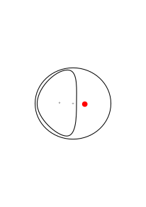
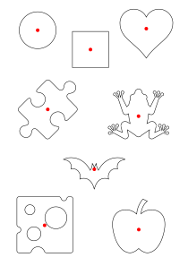

# Inkscape Centroid

Compute centroids for paths and shapes in [Inkscape](https://inkscape.org/) 

### How does this differ than default path measurement?

In short, this tool and the default path measurement (Center of Mass) are nearly identical. If you do not need to compute centroids of objects with holes, then the default tool should be preferred over this extension. Otherwise, this extension will accurately estimate the centroid of a shape with holes. See: 

Note that the default tool computes independent center of mass for both the outer and inner shape and draws a `+` for each. This extension removes the mass of the hole and draws a red circle at the center of mass of the remaining shape.
 
### Installation
There are two files, `centroid.inx` and `centroid.py` which must be copied into your Inkscape extensions folder. The exact location of the extensions dir can be found by opening `Edit --> Preferences --> System` and looking at the user extensions field.

### Usage

Inkscape Centroid can be found under `Extensions --> Generate from Path --> Centroid...`. If you don't see it there ensure you've installed the files into the extensions directory for Inkscape and restarted Inkscape.

There are two options in the dialog:

* Number of linear segments per curve, default 100. The more linear segments used the more precise the centroid will be. Generally increasing the number of segments is only necessary for complex curves.
* Radius of output centroid, default 10. Controls how large the output "dot" used to mark the centroid is.

#### Assumptions

Inkscape Centroid assumes the following:

1. The selected path(s) is closed
2. The selected path(s) do not intersect
3. If multiple paths are selected, there is one outer path which completely encloses the inner paths, and (1) and (2) hold true for each path

Multiple closed paths that are not contained within each other are not supported.

#### Examples

### Contributing

This is a project I created quickly to satisfy my own use case. I welcome any improvements in features, documentation, or otherwise!

### Attribution

|Graphic|Source|
|--|--|
|Apple|By Picol.org - http://picol.org/, CC BY 3.0, https://commons.wikimedia.org/w/index.php?curid=39292830|
|Heart|By Heart_left-highlight_jon_01.svg: Jon Phillipsderivative work: Bagande (talk) - Heart_left-highlight_jon_01.svg, CC0, https://commons.wikimedia.org/w/index.php?curid=6797194|
|Puzzle|By https://en.wikiversity.org/wiki/User:Rob-nowman - https://en.wikiversity.org/wiki/File:Wikiversity-Mooc-Icon-Associated-units.svg, CC BY-SA 3.0, https://commons.wikimedia.org/w/index.php?curid=36754677|
|Frog|By ХЕРАЛДИКА СССС - https://www.shareicon.net/toad-toads-amphibian-biology-animals-frogs-702138, CC BY-SA 4.0, https://commons.wikimedia.org/w/index.php?curid=71051987|
|Bat|By Christopher T. Howlett, from The Noun Project, CC BY 3.0, https://commons.wikimedia.org/w/index.php?curid=18497274|
|Cheese|By Carol Liao/toicon.com, CC BY 4.0, https://commons.wikimedia.org/w/index.php?curid=60818563|
